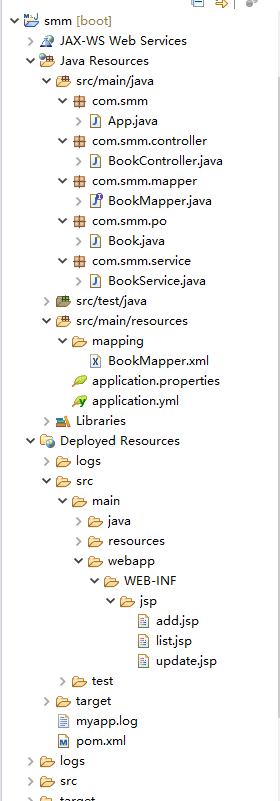
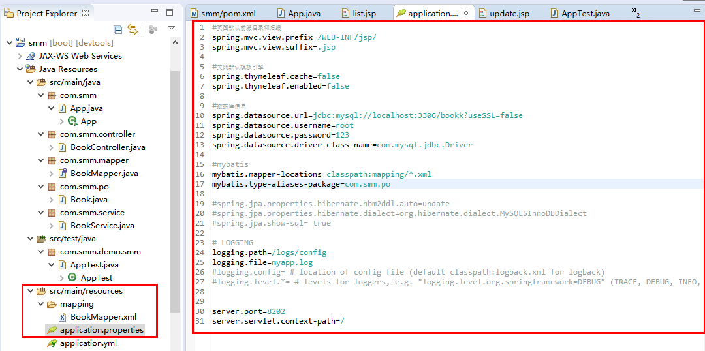
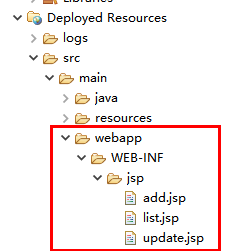
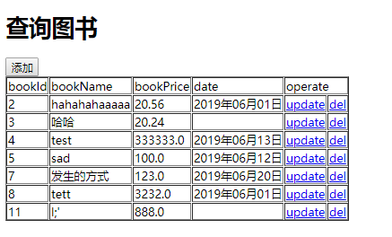
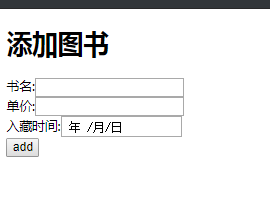
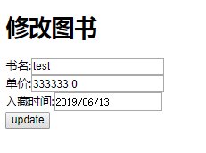

# Maven + SpringBoot + Mybatis
## 1 项目结构

## 2 步骤
### 2.1 新建Maven工程
### 2.2 编写配置pom.xml文件
~~~
<parent>
	<groupId>org.springframework.boot</groupId>
	<artifactId>spring-boot-starter-parent</artifactId>
	<version>2.0.0.RELEASE</version>
	<relativePath />
</parent>  
<properties>
	<project.build.sourceEncoding>UTF-8</project.build.sourceEncoding>
	<project.reporting.outputEncoding>UTF-8</project.reporting.outputEncoding>
	<java.version>1.8</java.version>
</properties>  
<dependencies>
    <!-- SpringBoot Web 依赖 -->
    <dependency>
        <groupId>org.springframework.boot</groupId>
        <artifactId>spring-boot-starter-web</artifactId>
    </dependency>

    <!-- Spring Boot 热部署 -->
    <dependency>
        <groupId>org.springframework.boot</groupId>
        <artifactId>spring-boot-devtools</artifactId>
    </dependency>

    <!-- mybatis -->
    <dependency>
        <groupId>org.mybatis.spring.boot</groupId>
        <artifactId>mybatis-spring-boot-starter</artifactId>
        <version>1.3.2</version>
    </dependency>

    <dependency>
        <groupId>mysql</groupId>
        <artifactId>mysql-connector-java</artifactId>
        <scope>runtime</scope>
    </dependency>

    <!-- tomcat支持 -->
    <dependency>
        <groupId>org.springframework.boot</groupId>
        <artifactId>spring-boot-starter-tomcat</artifactId>
    </dependency>

    <!-- 访问JSP页面必须配置 -->
    <dependency>
        <groupId>org.apache.tomcat.embed</groupId>
        <artifactId>tomcat-embed-jasper</artifactId>
    </dependency>

    <!-- jstl && standard -->
    <dependency>
        <groupId>javax.servlet</groupId>
        <artifactId>jstl</artifactId>
    </dependency>
</dependencies>  
<build>
    <plugins>
        <plugin>
            <groupId>org.springframework.boot</groupId>
            <artifactId>spring-boot-maven-plugin</artifactId>
        </plugin>
    </plugins>
</build>
~~~
### 2.3 编写application.properties文件

### 2.4 在WEB-INF下新建jsp文件夹，新建jsp文件

## 3 界面截图
  
  

## 4 遇到的问题
### 4.1 Date类型封装不上
~~~
    // 添加DateTimeFoemat解决
    @DateTimeFormat(pattern = "yyyy-MM-dd")
    private Date date;
~~~
### 4.2 input框Date类型赋值
#### 4.2.1 错误的赋值
~~~
<input type="date"  id="time" name="time"  value="2018-4-26" />
~~~
#### 4.2.2 正确的赋值
~~~
<input type="date"  id="time" name="time"  value="2018-04-26" />
~~~
#### 4.2.3 jsp日期格式化显示
~~~
<%@ taglib prefix="fmt"  uri="http://java.sun.com/jsp/jstl/fmt" %>

<fmt:formatDate value="${book.date}" pattern="yyyy年MM月dd日" />
~~~
[JSP 标准标签库](https://www.runoob.com/jsp/jsp-jstl.html)  
[项目构建参考资料](https://blog.csdn.net/madcode2222222222222/article/details/79063753)
